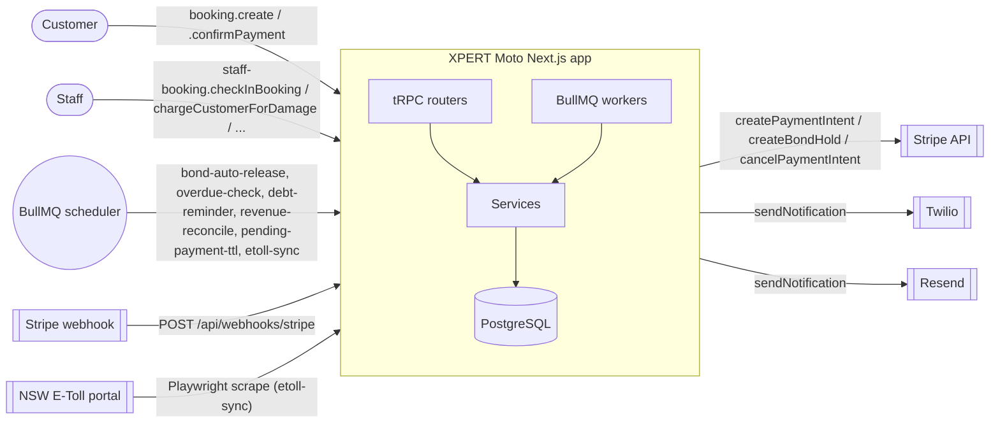
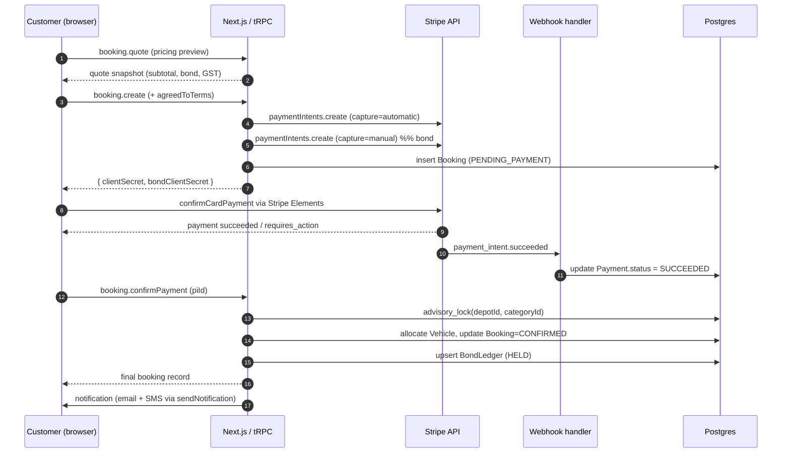
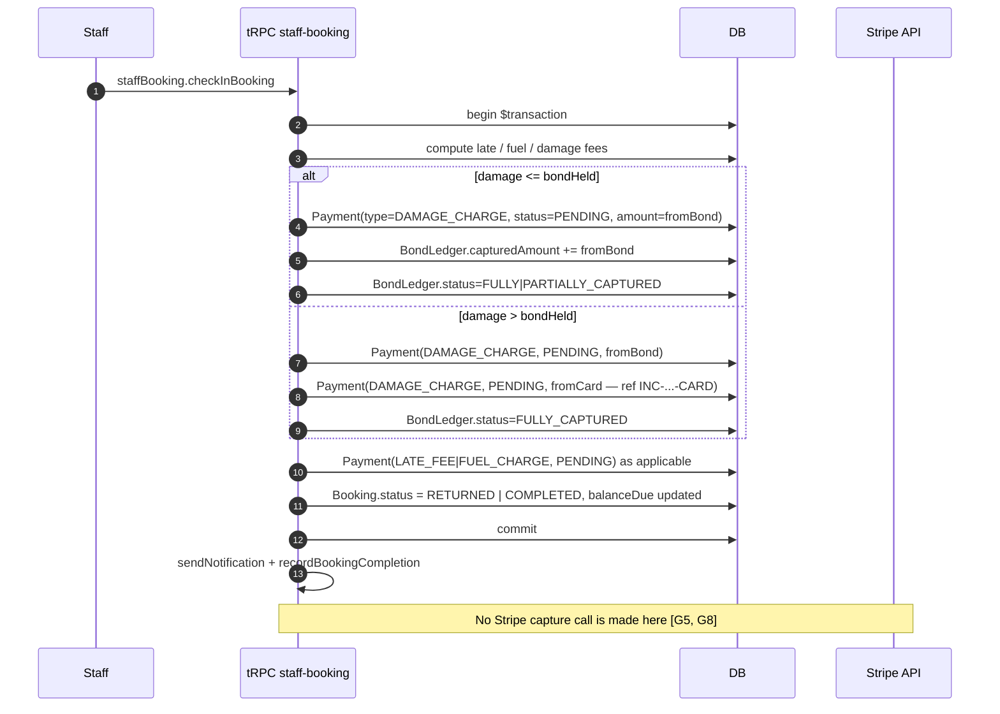
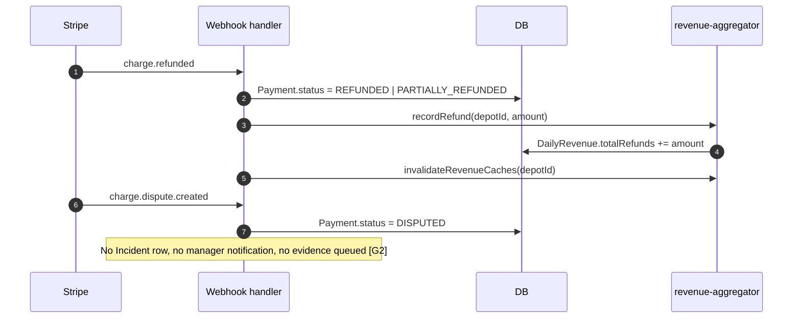
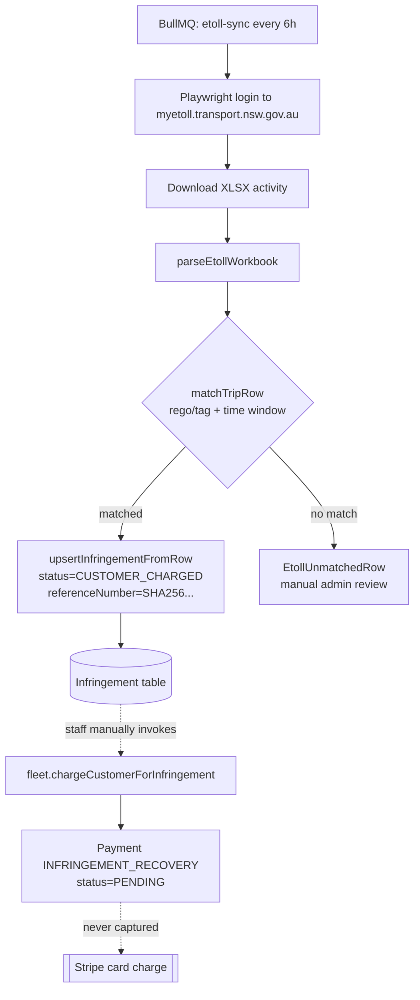
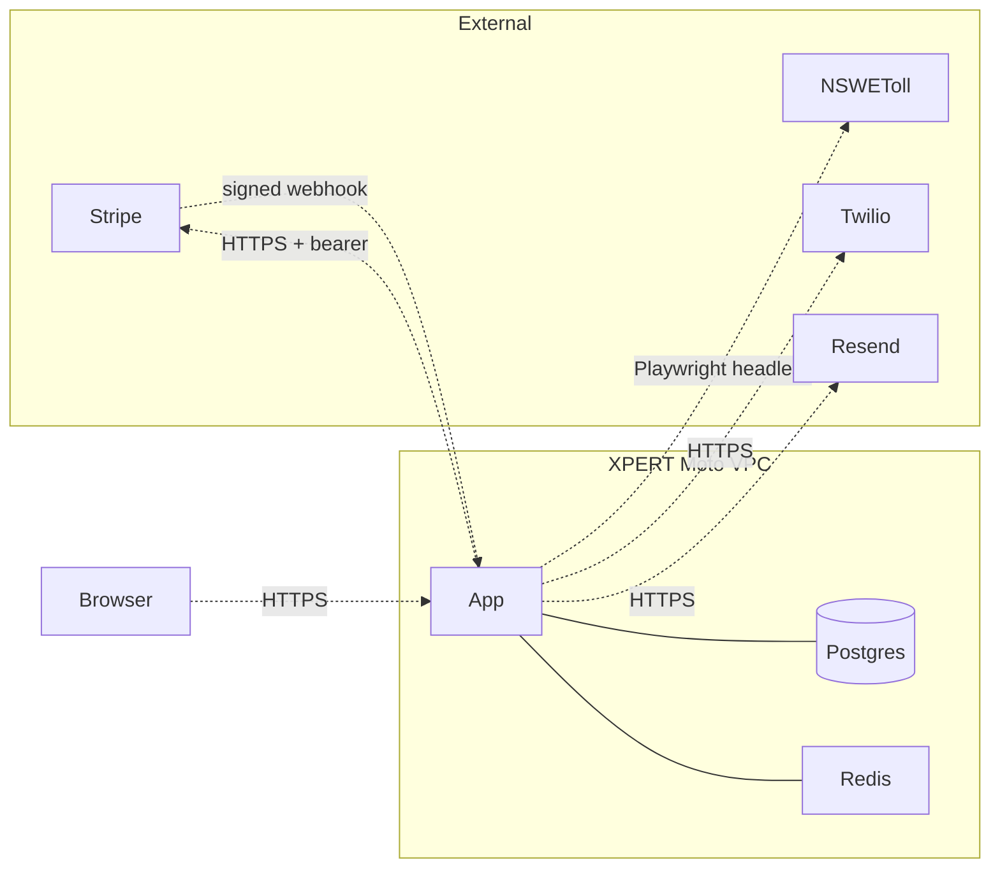

# Payments — Architecture & Data Flow

**Status:** Phase 1 discovery artefact. Captures what exists today (2026-04-18).
**Companion docs:** [state-machines.md](./state-machines.md), [integrations.md](./integrations.md), [risk-register.md](./risk-register.md), [reconciliation-spec.md](./reconciliation-spec.md), [compliance.md](./compliance.md).

---

## 1. Scope

This document maps every code path by which money moves — or fails to move — through XPERT Moto. It is intentionally literal: every arrow corresponds to a function call in the current codebase with file and function references. Gaps (paths the spec demands but the code does not implement) are called out inline with the `[G<n>]` marker that matches the risk register.

## 2. Top-level actor diagram

## 3. Booking → payment → confirmation

The canonical happy path. Vehicle allocation is deferred until payment is captured so that an unpaid quote cannot reserve stock.

**Code references**

- Quote: [src/server/trpc/router/booking.ts](/home/vlad/scootering/src/server/trpc/router/booking.ts) `quote`.
- Create: same file, `create` (creates PI + bond PI, persists Booking).
- Confirm: same file, `confirmPayment` (advisory lock + vehicle allocation + Payment row + BondLedger upsert).
- Stripe wrapper: [src/lib/stripe.ts](/home/vlad/scootering/src/lib/stripe.ts) `createPaymentIntent` (automatic capture), `createBondHold` (manual capture).
- Webhook: [src/app/api/webhooks/stripe/route.ts](/home/vlad/scootering/src/app/api/webhooks/stripe/route.ts) handles `payment_intent.succeeded`, `.amount_capturable_updated`, `.payment_failed`, `.canceled`, `charge.refunded`, `charge.dispute.created`, identity events.

**Gaps on this path**

- [G1] Webhook events are not logged to a dedup table; handlers are idempotent-by-shape but we can't prove a replay was processed exactly once.
- [G11] No 3DS2 / SCA step — `requires_action` is not wired on the client side.
- [G13] `writeAudit` is not called from `confirmPayment`; only `withAudit` on the webhook route captures the request.

## 4. Check-in → bond capture → additional charges

**Gaps on this path**

- [G5] PENDING Payment rows created here are never captured downstream. There is no job that walks PENDING Payments and calls Stripe.
- [G8] If a Stripe capture call were added inline, there is no retry queue; a transient Stripe 5xx would force the entire DB transaction to roll back and lose the bond state.
- [G9] No `PaymentEvent` append-only log; `Payment.status` is mutated in place, losing transition history.

## 5. Refund / chargeback

**Gaps**

- [G2] `charge.dispute.created` only flips `Payment.status`. No `Incident` is created, no manager notified, no representment evidence packet scheduled.
- [G12] No evidence compilation pipeline.

## 6. E-Toll ingestion → Infringement → recovery

**Code references**

- Scraper: [src/server/services/etoll.ts](/home/vlad/scootering/src/server/services/etoll.ts) `loginAndDownloadActivity`, `parseEtollWorkbook`, `matchTripRow`, `upsertInfringementFromRow`, `runEtollSync`.
- Scheduler: [src/server/jobs/etoll-sync.ts](/home/vlad/scootering/src/server/jobs/etoll-sync.ts) `startEtollScheduler`.
- Recovery mutation: [src/server/trpc/router/fleet.ts](/home/vlad/scootering/src/server/trpc/router/fleet.ts) `chargeCustomerForInfringement`.

**Gaps**

- [G5] Same capture gap — INFRINGEMENT_RECOVERY Payments remain PENDING forever.
- [G10] No admin fee / markup; `Infringement.amount` = raw toll.
- [G18] Linkt (VIC/QLD) integration is a stub — placeholder file only.
- [G6] Even if capture were added, there is no stored payment method to charge off-session once the booking has ended.

## 7. Background jobs — money-touching

| Job | Schedule | What it does | File |
|-----|----------|--------------|------|
| `pending-payment-ttl` | Nightly 03:00 AEST | Cancels `PENDING_PAYMENT` / `QUOTE` bookings older than 24h | [jobs/pending-payment-ttl.ts](/home/vlad/scootering/src/server/jobs/pending-payment-ttl.ts) |
| `bond-auto-release` | Nightly 02:00 | Releases bonds > 14d old on COMPLETED/RETURNED bookings | [jobs/bond-auto-release.ts](/home/vlad/scootering/src/server/jobs/bond-auto-release.ts) |
| `debt-reminder` | Daily 09:00 | One-shot reminder to debtors > threshold (cooldown-gated) | [jobs/debt-reminder.ts](/home/vlad/scootering/src/server/jobs/debt-reminder.ts) |
| `revenue-reconcile` | Nightly 02:15 | Rebuilds `DailyRevenue` rows from Booking aggregates | [jobs/revenue-reconcile.ts](/home/vlad/scootering/src/server/jobs/revenue-reconcile.ts) |
| `overdue-check` | Every 15 min | 4-stage escalation ladder on overdue bookings | [jobs/overdue-check.ts](/home/vlad/scootering/src/server/jobs/overdue-check.ts) |
| `etoll-sync` | Every 6h | Scrape + ingest NSW tolls | [jobs/etoll-sync.ts](/home/vlad/scootering/src/server/jobs/etoll-sync.ts) |

**Gaps — missing jobs**

- [G3] No Stripe-to-ledger reconciliation job.
- [G5] No PENDING-payment capture job.
- [G7] Dunning is one-shot; no 2nd / final / collections / write-off stages.
- [G8] No Stripe-capture retry queue.
- [G17] No invoice-generate job.

## 8. Trust boundaries

- **PAN**: never touches our servers. Stripe Elements / PaymentSheet in the browser posts directly to Stripe; we receive only tokens (`pi_...`, `ch_...`, `cus_...`).
- **Secrets**: `STRIPE_SECRET_KEY`, `STRIPE_WEBHOOK_SECRET`, E-Toll credentials live in `SystemSetting` (AES-256-GCM encrypted) with env-var fallback. See [src/lib/integration-config.ts](/home/vlad/scootering/src/lib/integration-config.ts).
- **Logs**: PII is redacted via pino paths (`stripePaymentIntentId`, licence, email, phone). Amounts are **not** currently redacted [G13].

## 9. Open questions that the other Phase-1 docs resolve

- *Exact* state machines for `Payment`, `BondLedger`, `DamageCharge`, `Infringement` → [state-machines.md](./state-machines.md).
- *Exact* auth model + failure modes for Stripe / E-Toll / Linkt / Twilio / Resend → [integrations.md](./integrations.md).
- *Likelihood × impact* scoring for each gap → [risk-register.md](./risk-register.md).
