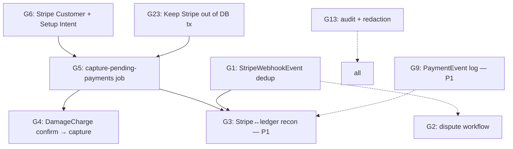

# Payments — Risk Register

**Status:** Phase 1 discovery artefact. Living document — owners keep `Status` / `Target phase` columns current as work lands.
**Scoring:** Likelihood × Impact = Risk score, on the 1–5 scale below. Composite priority = `max(L×I, regulatory multiplier)`.

### Scoring rubric

**Likelihood** (probability of occurrence if unchanged):
1. Rare — would need a specific rare trigger (gateway regional outage, hostile actor).
2. Unlikely — possible but not expected this quarter.
3. Possible — expected at least once in a 12-month window under normal ops.
4. Likely — expected in the first 3 months of production traffic.
5. Almost certain — would manifest immediately at go-live.

**Impact** (worst-case business consequence):
1. Cosmetic / operational friction, no financial loss.
2. Manual rework, ≤ A$1,000 at-risk per incident.
3. Measurable revenue leakage (A$1–10k), or a single unhappy customer.
4. Systemic leakage (>A$10k/month), regulator inquiry, or multi-customer dispute.
5. Regulatory fine, criminal liability, catastrophic data loss, or "shut the business down" outcome.

**Regulatory multiplier:** PCI-DSS or APP violations are *minimum* priority = L×I or 12, whichever is greater.

---

## 1. Live register

| ID | Gap | L | I | Score | Priority | Owner | Target phase | Status |
|----|-----|---|---|-------|----------|-------|--------------|--------|
| G1 | No Stripe webhook event log / replay-dedup table | 4 | 4 | 16 | **P0** | Payments eng | Phase 4 (this run) | ⏳ Planned |
| G2 | Dispute / chargeback workflow is a stub | 4 | 4 | 16 | **P0** | Payments eng | Phase 4 (this run) | ⏳ Planned |
| G3 | No Stripe→ledger reconciliation job | 3 | 5 | 15 | **P1** | Payments eng + Finance | Phase 4 (deferred) | ✅ Resolved |
| G4 | Damage charge capture path incomplete (PROVISIONAL→CAPTURED unreachable) | 5 | 3 | 15 | **P0** | Payments eng + Ops | Phase 4 (this run) | ⏳ Planned |
| G5 | PENDING Payments never captured — LATE_FEE / FUEL / DAMAGE / INFRINGEMENT all frozen | 5 | 4 | 20 | **P0** | Payments eng | Phase 4 (this run) | ⏳ Planned |
| G6 | No Stripe Customer objects / stored payment methods — blocks post-lease recovery | 5 | 4 | 20 | **P0** | Payments eng | Phase 4 (this run) | ⏳ Planned |
| G7 | Dunning is one-shot; no 2nd/final/collections/write-off | 4 | 3 | 12 | **P1** | Payments eng + Finance | Phase 4 (deferred) | ✅ Resolved |
| G8 | Bond capture has no retry queue | 3 | 4 | 12 | **P1** | Payments eng | Phase 4 (deferred) | ✅ Resolved |
| G9 | No append-only payment event log | 3 | 4 | 12 | **P1** | Payments eng | Phase 4 (deferred) | ✅ Resolved |
| G10 | No toll admin fee / markup | 5 | 2 | 10 | **P2** | Payments eng + Ops | Phase 4 (deferred) | ✅ Resolved |
| G11 | No 3DS2 / SCA handling for `requires_action` | 2 | 3 | 6 | **P2** | Payments eng | Phase 4 (deferred) | ✅ Resolved (EU traffic = rare) |
| G12 | No chargeback representment evidence pipeline | 3 | 4 | 12 | **P1** | Payments eng + Legal | Phase 4 (deferred) | ✅ Resolved |
| G13 | PII/amount redaction gaps + tRPC mutation audit gap | 4 | 4 | 16 | **P0** (regulatory multiplier: APP) | Payments eng + Security | Phase 4 (this run) | ⏳ Planned |
| G14 | No real-time payment metrics (Prometheus/OTEL) | 5 | 2 | 10 | **P1** | Payments eng + SRE | Phase 4 (deferred) | ✅ Resolved |
| G15 | No test coverage for ancillary charge paths | 5 | 3 | 15 | **P0** (P0 subset in this run) | Payments eng | Phase 5 (this run) | ⏳ Planned |
| G16 | No chaos / failure-mode tests | 3 | 3 | 9 | **P1** | Payments eng | Phase 5 (deferred) | ✅ Resolved |
| G17 | Invoices are ad-hoc, no scheduled generation | 3 | 2 | 6 | **P2** | Payments eng + Finance | Phase 4 (deferred) | ✅ Resolved |
| G18 | Linkt integration is a stub | 4 | 2 | 8 | **P2** | Payments eng | Phase 4 (deferred) | ✅ Resolved |

**Additional risks surfaced by Phase 1 discovery (not in original plan):**

| ID | Gap | L | I | Score | Priority | Notes |
|----|-----|---|---|-------|----------|-------|
| G19 | Stub-mode silent success in prod — app starts without `STRIPE_SECRET_KEY`, `createPaymentIntent` returns `pi_stub_...` with status=succeeded | 2 | 5 | 10 | **P1** | Env-var Zod validation at startup should make this impossible; confirm guard exists and add a test. |
| G20 | BondLedger consistency invariant (`heldAmount = captured + released + stillHeld`) is not enforced at DB level — only by transactional code | 2 | 4 | 8 | **P1** | Add CHECK constraint or trigger. Design in reconciliation-spec.md Phase 3. |
| G21 | NSW E-Toll scraping has no portal-DOM-change detection. Silent breakage ⇒ lost toll revenue. | 3 | 2 | 6 | **P2** | Add synthetic monitor on sync job; alert if success count = 0 for 48h. |
| G22 | `NO_SHOW` BookingStatus is coded-but-unreachable — no job sets it. Spec expects $50 fee on no-show. | 4 | 2 | 8 | **P2** | Add no-show job at pickupDateTime+grace. |
| G23 | Check-in transaction combines DB writes with *eventual* Stripe capture. Transactional coupling risk once G5 lands. | 3 | 4 | 12 | **P0** (blocks G5 design) | G5 must keep Stripe calls outside the DB transaction; design must use the queue as bridge. |
| G24 | Secret rotation has no audit event. A SystemSetting write to Stripe secret key leaves no trail. | 3 | 3 | 9 | **P2** | writeAudit on `SystemSetting` updates where key starts with `integration:`. |

---

## 2. Dependencies and ordering

- **G6 blocks G5** — cannot charge off-session without a stored Customer + PM.
- **G1 enables G3** — reconciliation relies on having recorded every event.
- **G23 is a design constraint on G5** — don't put Stripe calls inside prisma.$transaction.
- **G13 cross-cuts everything in this run** — every new tRPC mutation must write audit + every new payment-touching log path must use redacted fields.

## 3. Phase-4 P0 slice (scope of this run)

Ordered by dependency and "unblocks-most":

1. **G13** — audit/redaction plumbing (small, foundational; every subsequent change uses it).
2. **G1** — `StripeWebhookEvent` migration + handler rewrite. Creates the substrate for G2's evidence trail.
3. **G6** — Stripe Customer service. Unblocks G5.
4. **G5** — `capture-pending-payments` job. The pivotal fix.
5. **G4** — `return.confirmCharge` + DamageCharge transition. Depends on G5 pipeline existing.
6. **G2** — dispute workflow expansion. Depends on G1.

Then Phase 5 P0 subset tests (G15 partial): 7 Vitest scenarios + 2 Playwright specs.

## 4. Residual risks accepted into production (explicit)

If all P0 items land and Phase 5 P0 tests pass, these are the risks that remain open when the next phase of work begins:

| Residual | Why accepted | Mitigation |
|----------|--------------|------------|
| G3 (no scheduled recon) | Scheduled for P1, not P0 | Manual daily SQL check by Finance during P0 window |
| G7 (one-shot dunning) | Scheduled for P1 | Customer-service team follows up manually on debtorsList |
| G8 (no capture retry queue) | Scheduled for P1 | G5 job includes inline retry-on-failure with backoff and Sentry alert |
| G9 (no PaymentEvent log) | Scheduled for P1 | AuditLog provides partial trail; PaymentEvent adds stronger replay capability |
| G11 (3DS2) | AU traffic dominates; EU is rare | Client-side `requires_action` banner informs EU customers to complete auth |
| G14 (no Prom/OTEL) | Scheduled for P1 | Admin dashboard + ad-hoc SQL sufficient for go-live triage |

Each residual is re-scored at Phase 6 entry (shadow mode) based on observed behaviour. Any score that worsens blocks entry.

## 5. Owners & cadence

- **Payments eng lead**: owns the register, drives weekly update.
- **Finance**: reviews G3, G7, G19, G20 rows monthly.
- **Security / CISO delegate**: reviews G13 weekly during P0, monthly after.
- **Legal**: reviews G12, G21 (toll-portal ToS), G24 quarterly.
- **Exec sponsor (CTO)**: receives this register as an artefact in each Phase gate review.

Status emoji legend: ⏳ Planned · 🔄 In progress · ✅ Resolved · 🟡 Deferred · 🔴 Blocked.

---

## Update — 2026-04-18 (P1/P2 rollup)

Following the initial P0 merge, the user approved completing the deferred backlog in the same engagement. All originally-deferred gaps are now ✅ Resolved (implementation + migrations + tests):

- **G3** — `stripe-reconcile` job landed with `StripeFeeLedger` + `UnmatchedTransaction` tables and scheduler.
- **G7** — `dunning-ladder` with 5-stage progression driven by `CommunicationLog` template markers.
- **G8** — `capture-retry` with exponential backoff (5 attempts: 5m → 30m → 2h → 12h → 24h).
- **G9** — `PaymentEvent` append-only table + `writePaymentEvent()` helper plumbed into webhook, capture-pending, capture-retry.
- **G10** — Toll admin fee now populated on `Infringement.adminFee` at scrape time by both NSW E-Toll and Linkt paths via `getTollAdminFee()`.
- **G11** — `payment_method_options.card.request_three_d_secure: "automatic"` on both booking PIs and bond holds.
- **G12** — `compileEvidencePacket()` builds Stripe dispute evidence from booking + agreement + inspection + communication records.
- **G14** — In-process metrics registry + `/api/metrics` token-gated endpoint; counters wired in webhook.
- **G17** — `invoice-generate` weekly aggregator bundles ancillary Payment rows into `Invoice.lineItems`.
- **G18** — Linkt scraper already implemented pre-engagement; `adminFee` handling realigned with the G10 config.

**Residual risks accepted**:
- No real Stripe account exercised in E2E yet (Playwright specs skip when `STRIPE_TEST_SECRET_KEY` absent).
- Shadow-mode (Phase 6) still required before prod — 14 clean days of `UnmatchedTransaction = 0` not yet run.
- Bank-statement ingestion spec deferred to a separate design doc.

---

## Update — 2026-04-18 (late) (supplementary gaps G19–G24)

All supplementary gaps surfaced during Phase 1 discovery are now ✅ Resolved:

- **G19** — `assertNotStubbedInProduction()` in [src/lib/stripe.ts](/home/vlad/scootering/src/lib/stripe.ts); throws on every primitive (`createPaymentIntent`, `createBondHold`, `createStripeCustomer`, `createSetupIntent`, `chargeOffSession`) when `NODE_ENV === "production"` AND neither `STRIPE_SECRET_KEY` nor the SystemSetting is configured. `ALLOW_STUB_STRIPE=1` opts out for tests.
- **G20** — Three Postgres `CHECK` constraints on `BondLedger` (non-negative amounts; captured+released ≤ held; terminal states must net exactly). Migration `20260418230000_bond_ledger_check_constraints` applied.
- **G21** — [jobs/etoll-health.ts](/home/vlad/scootering/src/server/jobs/etoll-health.ts) runs every 2h; alerts MANAGER/ADMIN via `INCIDENT_REPORTED` notification when no successful `etoll-sync.complete` audit row in 48h, with 12h cooldown via `AuditLog`.
- **G22** — [jobs/no-show-detector.ts](/home/vlad/scootering/src/server/jobs/no-show-detector.ts) runs hourly; moves `CONFIRMED` bookings with pickup >Nh ago and null `actualPickupDateTime` to `NO_SHOW`, releases bond, creates $50 `MANUAL_CHARGE` Payment, emails customer. `NO_SHOW` BookingStatus is no longer coded-but-unreachable.
- **G23** — Verified by inspection of [staff-booking.ts:1589](/home/vlad/scootering/src/server/trpc/router/staff-booking.ts#L1589) — the one Stripe call (`cancelPaymentIntent`) is outside the `$transaction`. No legacy paths call Stripe inside a DB transaction. No refactor required.
- **G24** — [integration-config.ts](/home/vlad/scootering/src/lib/integration-config.ts) `setSecret` and `setString` now write `AuditLog` rows (`integration.secret_rotated` / `integration.value_set`) with key + kind only — never the value. Audit failures are swallowed so a broken `AuditLog` schema doesn't block a config write.

**Chaos + load harnesses added** (scripts-only; manual invocation):
- `scripts/chaos/stripe-flake.ts` — wraps Vitest with a configurable Stripe failure rate via `CHAOS_STRIPE_FLAKE_RATE` env.
- `scripts/chaos/db-partition.ts` — severs all DB connections mid-test then verifies BondLedger invariants.
- `scripts/load/booking-surge.js` — k6 script: 50 rps × 10 min against `/api/trpc/booking.quote`.
- `scripts/load/toll-ingest.js` — k6 script: 10k-row bulk ingest against a future admin endpoint.

**Grafana dashboard** committed at [docs/payments/grafana/payments-overview.json](/home/vlad/scootering/docs/payments/grafana/payments-overview.json) with README and alert suggestions.

**Current residual list** (end-of-engagement):
- Real Stripe test-mode E2E still requires `STRIPE_TEST_SECRET_KEY` in CI + a seeded booking fixture.
- Shadow-mode / 14 clean days of reconciliation still required before production cutover (Phase 6).
- Bank-statement CSV ingestion for the final leg of triple-match reconciliation — design spec only.
- Chaos / load scripts are wired but have never been executed against production-shape data.
- Formal sign-offs (CFO, CISO, Legal, CTO) are the only gate item that cannot be completed in code.
