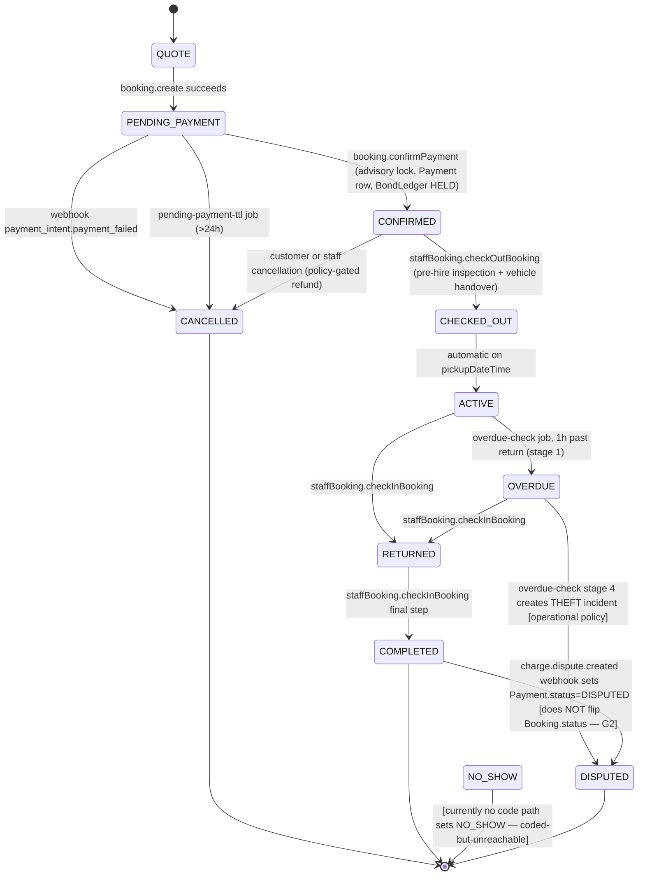
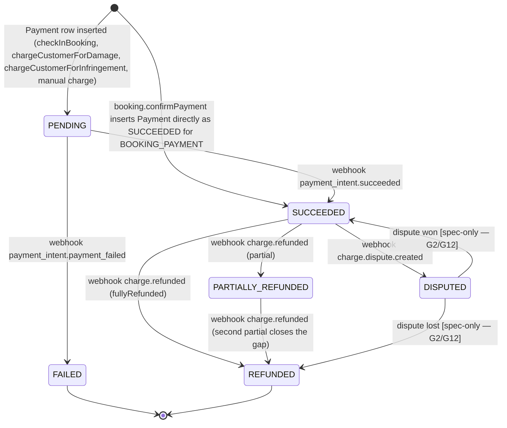
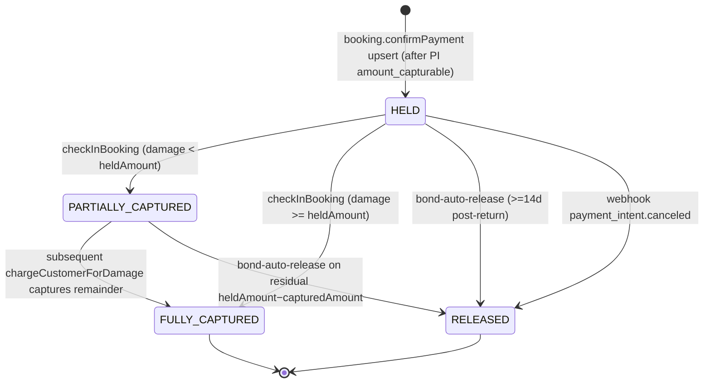
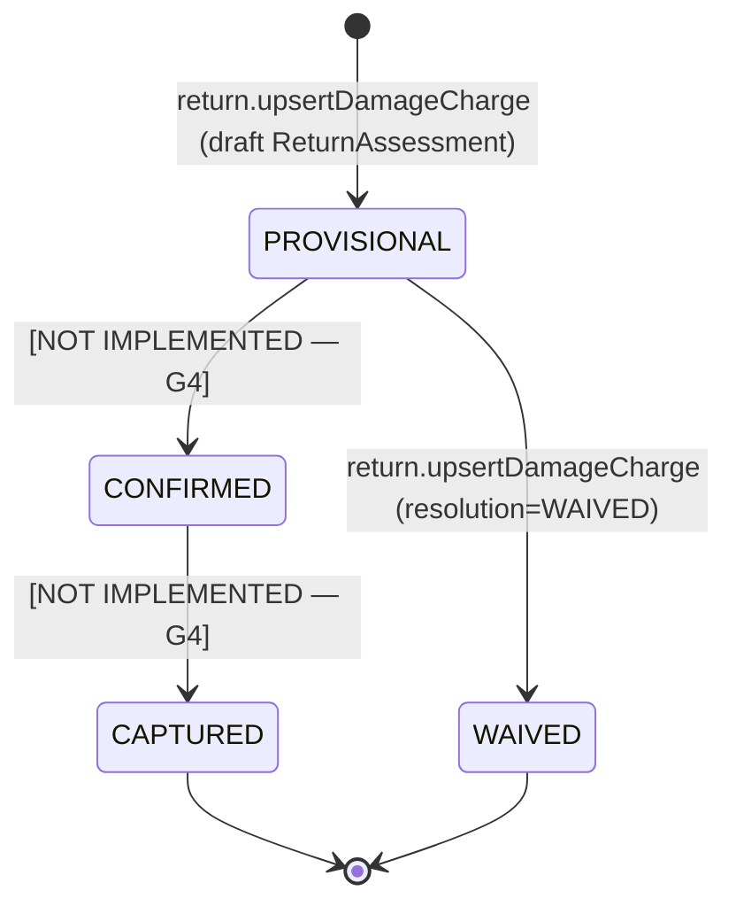
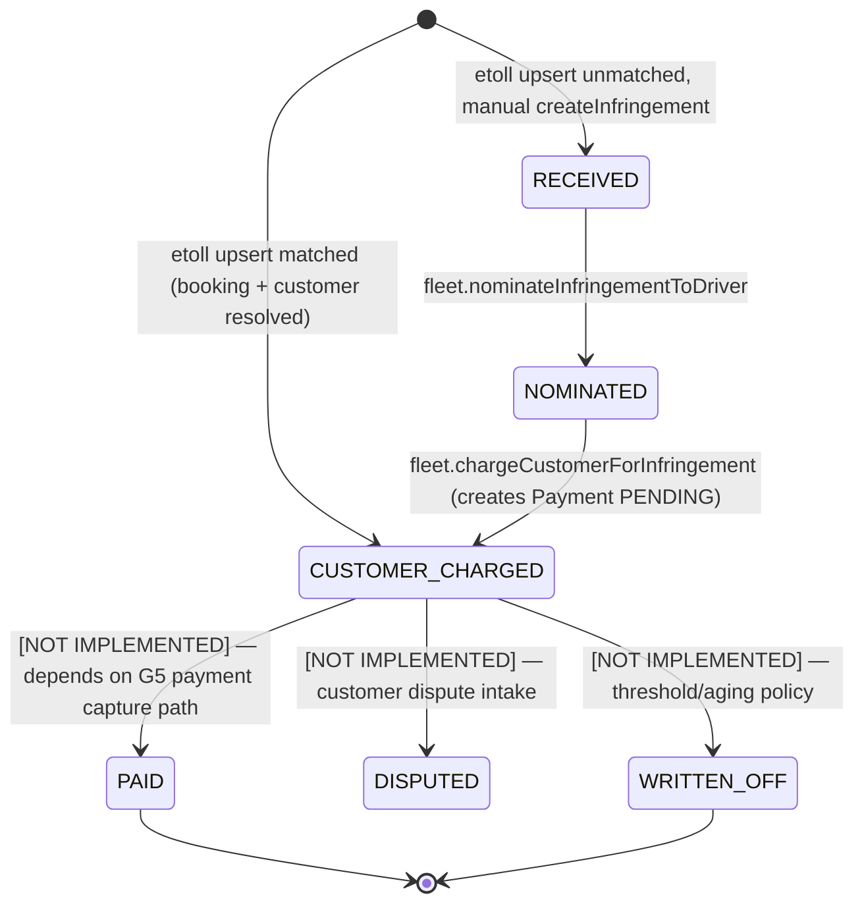
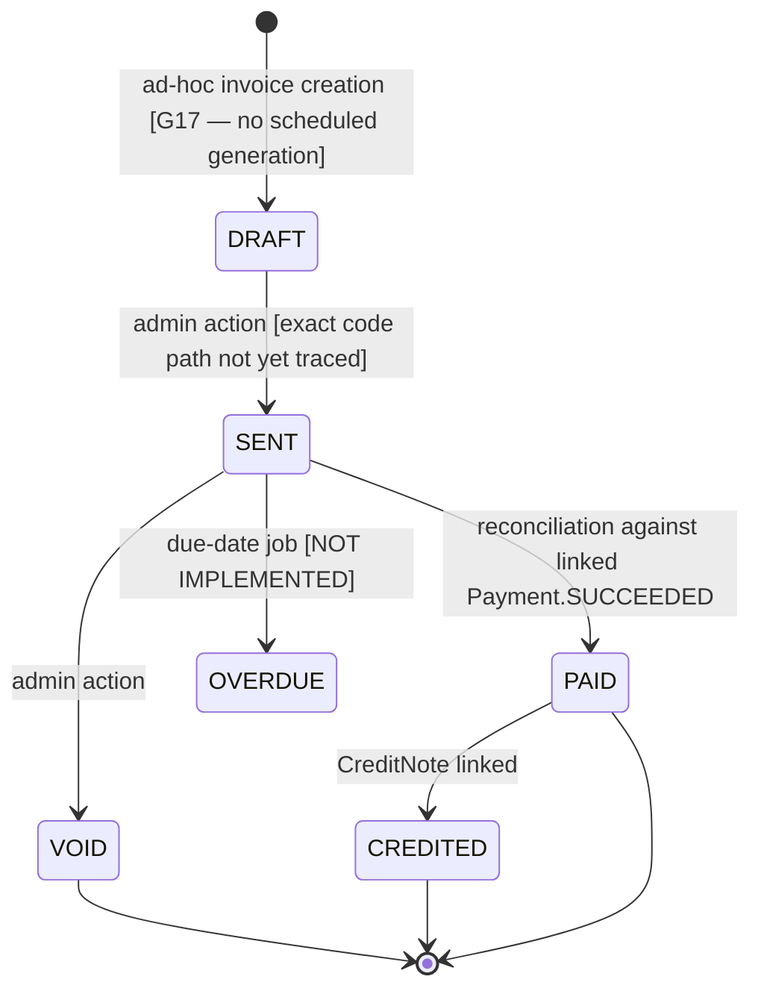

# Payments — State Machines

**Status:** Phase 1 discovery artefact.
**Purpose:** Enumerate every state transition for every money-adjacent entity — distinguishing **coded** transitions (real code path exists today), **coded-but-unreachable** (schema state exists but no code writes it), and **spec-only** (CLAUDE.md demands it but schema is silent).

Entities covered: `Booking.status`, `Payment.status`, `BondLedger.status`, `DamageCharge.status`, `Infringement.status`, `Invoice.status`. Each section ends with a traceability block mapping transitions to the source function.

---

## 1. Booking.status

Enum values from [prisma/schema.prisma:89-101](/home/vlad/scootering/prisma/schema.prisma#L89-L101): `QUOTE, PENDING_PAYMENT, CONFIRMED, CHECKED_OUT, ACTIVE, OVERDUE, RETURNED, COMPLETED, CANCELLED, NO_SHOW, DISPUTED`.

**Transition traceability**

| From | To | Code | Notes |
|------|----|------|-------|
| `QUOTE` → `PENDING_PAYMENT` | `booking.create` | [booking.ts](/home/vlad/scootering/src/server/trpc/router/booking.ts) | Creates PI + bond PI |
| `PENDING_PAYMENT` → `CONFIRMED` | `booking.confirmPayment` | booking.ts | Advisory lock + vehicle alloc |
| `PENDING_PAYMENT` → `CANCELLED` | webhook + job | [webhooks/stripe/route.ts:96-139](/home/vlad/scootering/src/app/api/webhooks/stripe/route.ts#L96-L139), [jobs/pending-payment-ttl.ts](/home/vlad/scootering/src/server/jobs/pending-payment-ttl.ts) | Belt-and-braces |
| `ACTIVE` → `OVERDUE` | overdue-check stage 1 | [jobs/overdue-check.ts](/home/vlad/scootering/src/server/jobs/overdue-check.ts) | 1h grace |
| `OVERDUE` → `DISPUTED` | — | overdue-check stage 4 creates THEFT Incident; Booking itself stays OVERDUE | **Code does not set DISPUTED** |
| `*` → `NO_SHOW` | — | — | **Coded-but-unreachable.** No code sets NO_SHOW. Should be set by a no-show job at pickupDateTime+Nh. Spec CLAUDE.md §A3 implies it. [P2 gap, not in risk register yet]|

## 2. Payment.status

Enum values [prisma/schema.prisma:134-141](/home/vlad/scootering/prisma/schema.prisma#L134-L141): `PENDING, SUCCEEDED, FAILED, REFUNDED, PARTIALLY_REFUNDED, DISPUTED`.

**Critical observation.** `PENDING → SUCCEEDED` is only driven by the webhook. The webhook path requires a `stripePaymentIntentId` on the Payment row. **Most PENDING rows created at check-in (LATE_FEE, FUEL_CHARGE, DAMAGE_CHARGE, INFRINGEMENT_RECOVERY) have no `stripePaymentIntentId`**, so the webhook never fires for them — they remain PENDING forever. This is [G5].

| Transition | Driver | File | Status |
|------------|--------|------|--------|
| `→ PENDING` | check-in, damage, infringement charges | [staff-booking.ts](/home/vlad/scootering/src/server/trpc/router/staff-booking.ts), [fleet.ts](/home/vlad/scootering/src/server/trpc/router/fleet.ts) | coded |
| `→ SUCCEEDED` (direct) | `confirmPayment` for BOOKING_PAYMENT | [booking.ts](/home/vlad/scootering/src/server/trpc/router/booking.ts) | coded |
| `PENDING → SUCCEEDED` | webhook `payment_intent.succeeded` | [webhooks/stripe/route.ts:50-86](/home/vlad/scootering/src/app/api/webhooks/stripe/route.ts#L50-L86) | coded, only fires if `stripePaymentIntentId` set |
| `PENDING → FAILED` | webhook `payment_intent.payment_failed` | [webhooks/stripe/route.ts:96-139](/home/vlad/scootering/src/app/api/webhooks/stripe/route.ts#L96-L139) | coded |
| `SUCCEEDED → REFUNDED` | webhook `charge.refunded` | [webhooks/stripe/route.ts:141-167](/home/vlad/scootering/src/app/api/webhooks/stripe/route.ts#L141-L167) | coded |
| `SUCCEEDED → DISPUTED` | webhook `charge.dispute.created` | [webhooks/stripe/route.ts:169-177](/home/vlad/scootering/src/app/api/webhooks/stripe/route.ts#L169-L177) | coded |
| `DISPUTED → SUCCEEDED|REFUNDED` | — | — | **spec-only [G2, G12]**: no handler for `charge.dispute.closed` + representment outcome |

## 3. BondLedger.status

Enum values [schema.prisma:152-157](/home/vlad/scootering/prisma/schema.prisma#L152-L157): `HELD, PARTIALLY_CAPTURED, FULLY_CAPTURED, RELEASED`.

**Consistency invariant** (must hold always):
`heldAmount == capturedAmount + releasedAmount + stillHeldPortion`, where `stillHeldPortion` is `0` in terminal states.

The `deductions` JSON (`Array<{ reason: string, amount: number }>`) is the audit trail of individual capture events. **No explicit CHECK constraint** in the database enforces this invariant — relying on transactional code only. This is a latent correctness risk (flagged in Phase 3 reconciliation-spec).

| Transition | Driver | File | Status |
|------------|--------|------|--------|
| `→ HELD` | `confirmPayment` upsert | [booking.ts](/home/vlad/scootering/src/server/trpc/router/booking.ts) | coded |
| `→ HELD` (reaffirm) | webhook `payment_intent.amount_capturable_updated` | [webhooks/stripe/route.ts:88-95](/home/vlad/scootering/src/app/api/webhooks/stripe/route.ts#L88-L95) | coded |
| `HELD → PARTIALLY_CAPTURED` | `checkInBooking`, `chargeCustomerForDamage` | [staff-booking.ts](/home/vlad/scootering/src/server/trpc/router/staff-booking.ts) | coded |
| `HELD → FULLY_CAPTURED` | `checkInBooking`, `chargeCustomerForDamage` | staff-booking.ts | coded |
| `HELD → RELEASED` | job, webhook | [jobs/bond-auto-release.ts](/home/vlad/scootering/src/server/jobs/bond-auto-release.ts), webhook | coded |

## 4. DamageCharge.status

Enum `ChargeStatus` (inferred from [schema.prisma:1974-2007](/home/vlad/scootering/prisma/schema.prisma)): `PROVISIONAL, CONFIRMED, CAPTURED, WAIVED`.

**Gap [G4].** No code transitions `PROVISIONAL → CONFIRMED` or `CONFIRMED → CAPTURED`. `finalise` on the ReturnAssessment seals the PDF but does not move damage lines forward. In practice, check-in already writes DAMAGE_CHARGE `Payment` rows (PENDING), which is a parallel path that bypasses DamageCharge entirely — leading to two different surfaces for "was this damage captured?" to disagree.

**Required to close G4**: a new `return.confirmCharge` tRPC mutation that (a) transitions DamageCharge to CONFIRMED, (b) creates (or attaches to) a Payment row, (c) enqueues capture via the new `capture-pending-payments` job, (d) on capture success moves DamageCharge → CAPTURED.

## 5. Infringement.status

Enum [schema.prisma:1440-1458](/home/vlad/scootering/prisma/schema.prisma): `RECEIVED, NOMINATED, CUSTOMER_CHARGED, PAID, DISPUTED, WRITTEN_OFF`.

**Mapping to the Payment state machine.** An Infringement moving to `PAID` should follow from its linked `Payment(type=INFRINGEMENT_RECOVERY)` moving to `SUCCEEDED`. That cross-entity sync is currently absent — closing it is part of G5's design.

## 6. Invoice.status

Enum [schema.prisma:143-150](/home/vlad/scootering/prisma/schema.prisma#L143-L150): `DRAFT, SENT, PAID, OVERDUE, VOID, CREDITED`.

**Gap [G17]**. Invoices today are created ad-hoc; there is no `invoice-generate` job, no overdue-detection job, and `CreditNote` has no status field (it's effectively an append-only negative line). Pushing this to P2 is acceptable because no payment path is blocked on it, but admins can't send outstanding-balance invoices programmatically today.

## 7. Cross-entity sync rules (authoritative)

These are the invariants that the P0 capture pipeline (G5) must uphold. They do not all hold today.

1. `Payment(type=BOOKING_PAYMENT, booking=B).status = SUCCEEDED` **⇒** `Booking(B).status ∈ {CONFIRMED, CHECKED_OUT, ACTIVE, OVERDUE, RETURNED, COMPLETED, DISPUTED}`. Never `PENDING_PAYMENT` or `QUOTE`. — **holds today.**
2. `BondLedger(B).capturedAmount = Σ Payment(type=DAMAGE_CHARGE, booking=B, status∈{SUCCEEDED}) where amount ≤ bond`. — **does not hold** because PENDING damage rows never transition (G5).
3. `Infringement(I).status = PAID` ⇔ `Payment(type=INFRINGEMENT_RECOVERY, reference=INFR-I).status = SUCCEEDED`. — **does not hold** — no code syncs the two (G5).
4. `DamageCharge(D).status = CAPTURED` ⇔ `Payment linked via D.capturedPaymentId exists and is SUCCEEDED`. — **partially holds** (schema has the FK; no writer; G4).
5. After `charge.dispute.created` for payment `P` linked to booking `B`, there exists `Incident(type=CHARGEBACK, paymentId=P)`. — **does not hold** (G2).

Every invariant above becomes a **test assertion** in the Phase 5 scenario suite.

## 8. What the P0 work changes

After the P0 implementation lands, the following transitions become code-reachable for the first time:

- `DamageCharge.PROVISIONAL → CONFIRMED → CAPTURED` (G4).
- `Payment.PENDING → SUCCEEDED` for LATE_FEE / FUEL_CHARGE / DAMAGE_CHARGE / INFRINGEMENT_RECOVERY types, via the new `capture-pending-payments` job (G5) calling Stripe off-session against a stored customer (G6).
- `Booking.DISPUTED` from chargeback events + corresponding `Incident(CHARGEBACK)` creation (G2).

New transitions added in P1 (out of this run) close invariants 3 and the dispute-outcome half of the Payment diagram.
